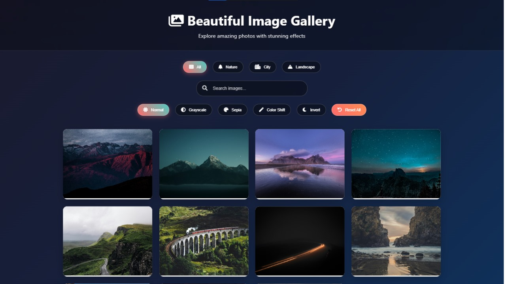
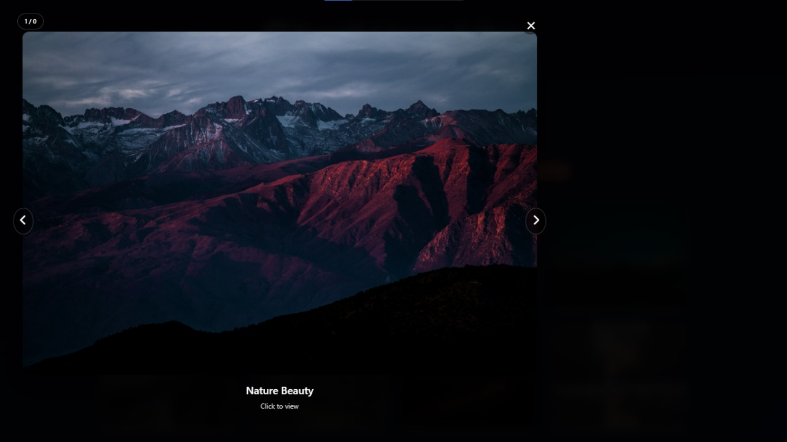
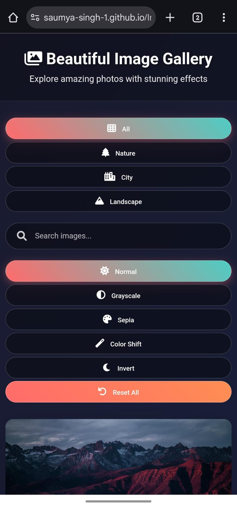

# 🖼️ Image Gallery

This project was developed as part of my **CodeAlpha Internship**.  
It is a **responsive image gallery web application** that allows users to view images in a clean, organized grid layout with an interactive lightbox feature.

---

## ✨ Features

- Responsive **image grid layout**
- **Lightbox view** for enlarged image previews
- **Next/Previous navigation** inside the lightbox
- Smooth transitions & animations ✨
- Works on **desktop and mobile**
- Clean and minimal design 🎨

---

## 🚀 Live Demo
  
🔗 [View Live Project](https://saumya-singh-1.github.io/ImageGallery_CodeAlpha/)

---

## 🛠️ Built With

- [HTML5](https://developer.mozilla.org/en-US/docs/Web/HTML)  
- [CSS3](https://developer.mozilla.org/en-US/docs/Web/CSS)  
- [JavaScript](https://developer.mozilla.org/en-US/docs/Web/JavaScript)  

---

## 📸 Screenshots

### Gallery View  

### Lightbox View  

### Phone View (Header)

### Phone View (Footer)

### Phone Lightbox view

---

## 👨‍💻 Author

- **Saumya Singh**  
  GitHub: [@saumya-singh-1](https://github.com/saumya-singh-1)  
  LinkedIn: [@saumyasingh](https://www.linkedin.com/in/saumya-singh-0256b5378/)  

---

## 🎯 Internship Note

This project was built as part of the **CodeAlpha Internship Program (2025)**.  
It helped me practice **responsive design, DOM manipulation, and interactive UI development**.  
